# Wayfinder

A Pathfinder 1st Edition character sheet that lives in Obsidian's right sidebar. Wayfinder keeps a full, rules-aware character — abilities, classes, combat, skills, spells, and gear — beside your notes, and is laid out for one-handed use on an iPad at the table.

Your character data is stored by the plugin itself, not in note frontmatter, so a sheet is not tied to any one note. Rules text stays as ordinary Markdown notes in your vault, which Wayfinder links to from the relevant places on the sheet.

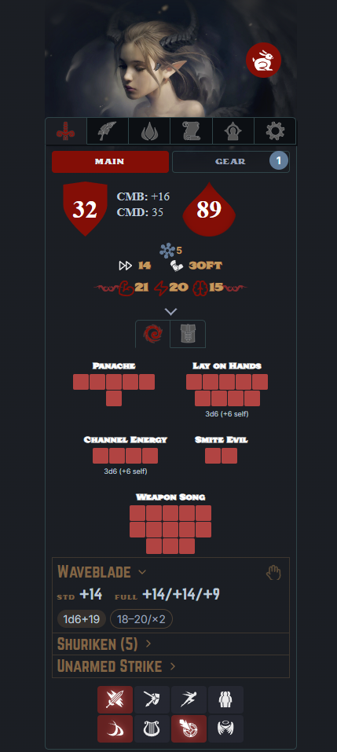

*Screenshots show two sample characters: **Adarin**, a level 11 Tiefling Paladin / Skald / Monk, and **Maelis**, a 13th-level Arcanist who stands in for a denser, full-arcane spellbook. The References tab is shown with the optional [Carrel](#references) plugin enabled.*

> **Wayfinder is a character _sheet_, not a character _builder_.** It does not enforce prerequisites or cascade rules as you make choices. Aside from a few conveniences — picking a race fills in its racial traits, and adding a class seeds its resource pools and flags its class skills — it trusts you to build a legal (or house-legal!) character by the book, then does the math from there: armor class, saves, attack lines, skill totals, spell DCs, and the rest. You bring the rules knowledge; Wayfinder keeps the arithmetic correct and out of your way.

## Installation

### From Obsidian (recommended)

1. Open **Settings → Community plugins** and turn off Restricted Mode if it is on.
2. Click **Browse**, search for **Wayfinder**, and select **Install**.
3. Click **Enable**.
4. Open the sheet with the shield icon in the left ribbon, or run the command **Wayfinder: Open sheet**.

### From BRAT (beta releases)

[BRAT](https://github.com/TfTHacker/obsidian42-brat) (the Beta Reviewers Auto-update Tool) installs and updates pre-release builds before they reach the Community Plugins directory — handy for trying new features early.

1. Install **BRAT** from the Community Plugins browser and enable it.
2. Open the command palette and run **BRAT: Add a beta plugin for testing**.
3. Enter the repository: `alas-poor-ophelia/wayfinder`
4. BRAT downloads the latest release and installs Wayfinder. Enable it under **Settings → Community plugins**.
5. To update later, run **BRAT: Check for updates to all beta plugins**.

### Manual

1. Download `main.js`, `styles.css`, and `manifest.json` from the [latest release](https://github.com/alas-poor-ophelia/wayfinder/releases).
2. Copy them into `<your vault>/.obsidian/plugins/wayfinder/`.
3. Reload Obsidian, then enable **Wayfinder** under Community plugins.

## Quick start

1. Run **Wayfinder: Open sheet** to dock the sheet in the right sidebar.
2. Run **Wayfinder: New character** and give it a name. The configuration screen opens in the main pane.
3. Under **Character**, set the race, ability scores, and one or more classes (with levels and archetypes).
4. Under **Skills**, add the standard skill list and assign ranks.
5. Close the configuration screen. The sidebar sheet now shows your computed armor class, saves, attacks, and skill totals.

Everything the sheet displays — armor class, save bonuses, attack lines, skill totals, spell DCs — is derived from what you enter. Derived numbers are never stored, so they stay correct as you change the underlying values.

## Features

### Character building

Build single-class or multiclass characters with archetypes, races, and racial heritages. Selecting a race fills in its size, speed, senses, ability adjustments, and spell-like abilities; heritages (such as the various tiefling and aasimar variants) layer their own traits on top. Hit points and most defenses are computed from your classes and ability scores, with manual overrides where you need them. A few archetypes are only partially implemented and are labelled *partial* when you pick one — they still work, but may need a detail or two added by hand (see [Known limitations](#known-limitations)).

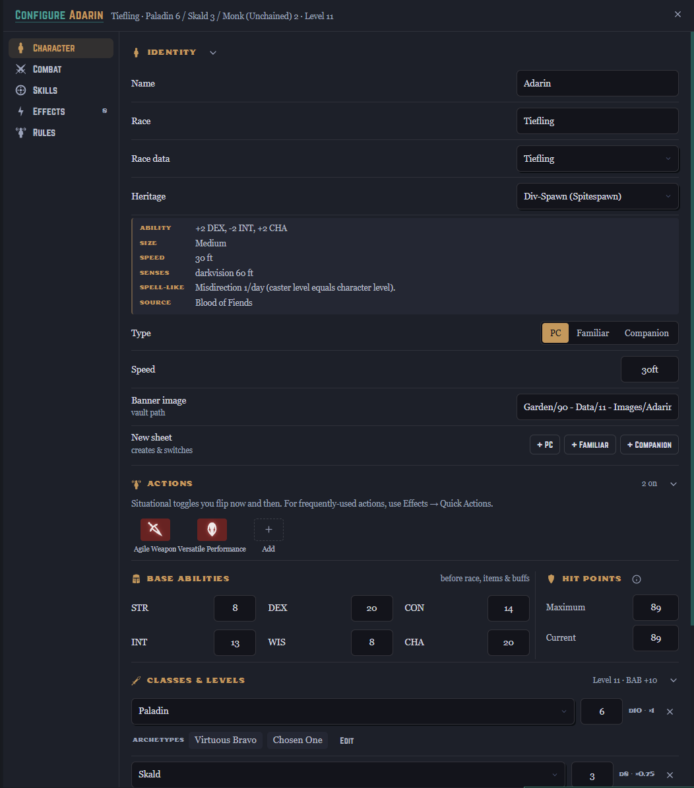

### Combat

The Combat tab is the at-a-glance view you keep open during play:

- Armor class, plus touch and flat-footed values, with CMB and CMD a tap away.
- Hit points with a current/maximum tracker.
- Fortitude, Reflex, and Will saves, each showing its breakdown.
- Initiative, speed, and energy resistances.
- Attack lines that derive from your equipped weapons — damage dice, enhancement, and ability modifiers are read from the gear you have equipped.

### Quick actions and resource pools

Situational toggles — Power Attack, Fighting Defensively, Smite Evil, Charge, and so on — sit in a grid on the Combat tab. Tapping one applies its modifiers to the relevant numbers and cycles through any stages it has. A new character starts with the actions any character can take — Charge, Fighting Defensively, and the like — while class-specific ones wait on the bench; you choose which appear on the sheet, and you can build your own from a small set of effect types (modifiers, AC changes, extra damage dice, notes).

Resource pools track expendable resources such as Lay on Hands, Ki, Panache, or Channel Energy. A pool's maximum can be a fixed number, derived automatically from a class, or computed from a formula (for example, half your paladin level plus your Charisma modifier).

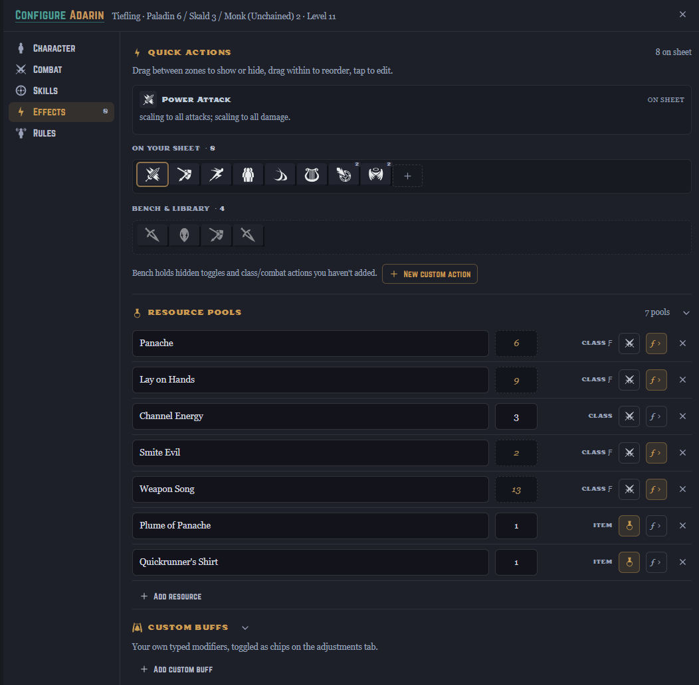

### Skills

The Skills tab lists every skill colored by its governing ability, with the total modifier and a breakdown into ranks, ability modifier, and miscellaneous bonuses. Class skills are flagged and receive their bonus automatically.

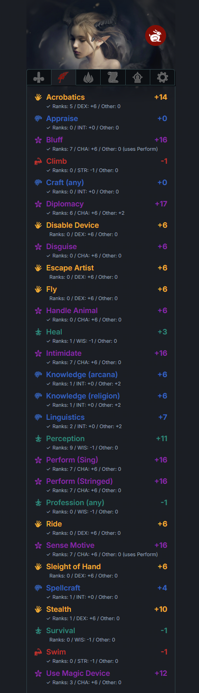

### Spells and the spell database

Wayfinder handles prepared, spontaneous, and hybrid casters, laying out each spell level with the right prepared counts or known markers and computing save DCs from your casting ability. Spell-like abilities, per-day uses, and metamagic are all tracked on the sheet.

The tab scales with the caster. A partial caster shows a short list; a full arcane caster shows a spellbook that runs from cantrips up through its highest level, with metamagic and per-level trackers. Below, Adarin's handful of Paladin / Skald spells and spell-like abilities sits beside Maelis the Arcanist's spellbook, laid out level by level from cantrips up:

| A partial caster | A full arcane caster |
| --- | --- |
| 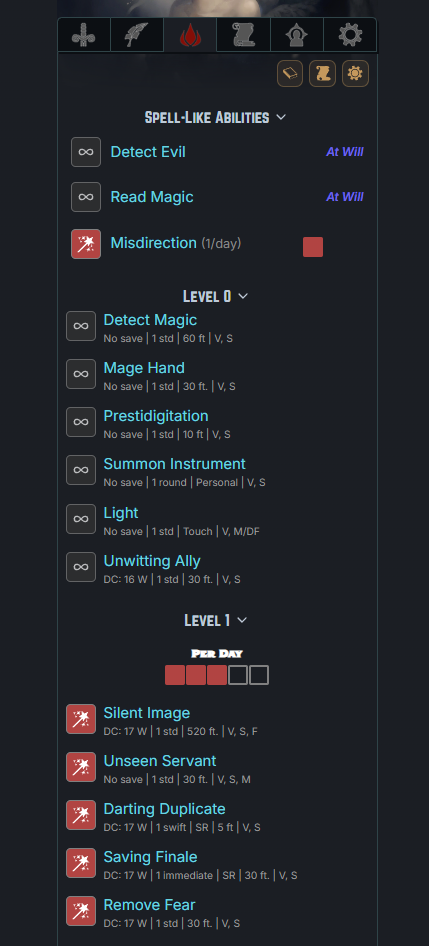 | 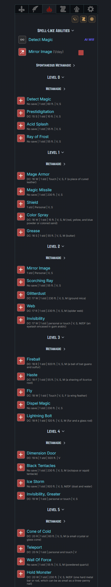 |

A bundled database of more than 2,800 spells is searchable and filterable by class, level, school, components, source, and more. Add spells to a character with a click, and save sets of spells as named loadouts you can switch between.

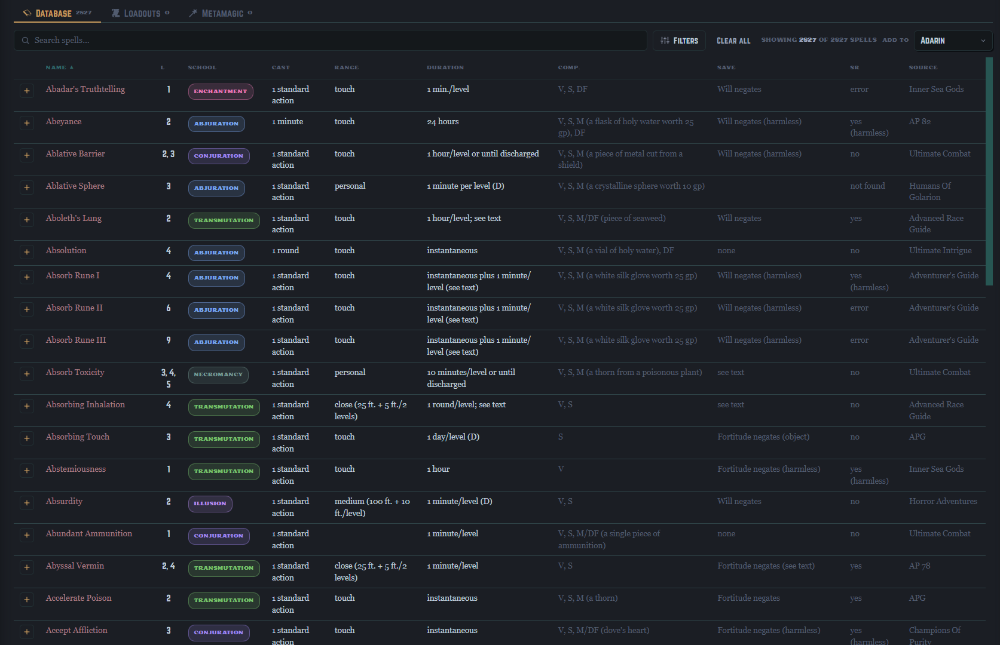

#### Spell reference notes (optional)

Wayfinder bundles the spell **database** — the searchable table and the numbers behind every DC and slot — but not the full spell **text**. The complete set of per-spell reference notes (one Markdown file per spell, Open Game Content distributed under the OGL) runs to thousands of files, far past the size a plugin is allowed to bundle, so it ships separately.

To read spell descriptions in the sidebar, grab the note pack, drop the folder into your vault, and point **Settings → Wayfinder → Spells folder** at it. The spellbook then links each known spell straight to its description. Clone it:

```
git clone https://github.com/alas-poor-ophelia/wayfinder-rules.git
```

or download it as a ZIP from the [repository page](https://github.com/alas-poor-ophelia/wayfinder-rules) and unzip it into your vault. The notes are plain Markdown — yours to trim, annotate, or replace. None of this is required: without the pack, the database and every calculation still work; you just won't have the full spell text on tap.

### Equipment

A bundled item catalog — 330 weapons, 65 armors, and over 3,000 magic items — is searchable and filterable, and items add to a character's inventory directly from the table. Equipped weapons become attack lines; equipped armor and magic items apply their bonuses automatically.

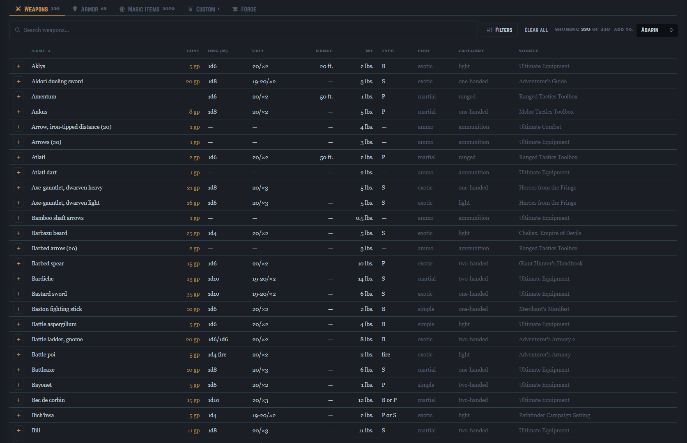

The inventory itself supports quantities, weight and value, containers for nesting items, wand charges, currency, and an encumbrance readout. A separate **party inventory** holds shared loot, with its own currency pool and per-item owners.

| A character's inventory | The shared party inventory |
| --- | --- |
| 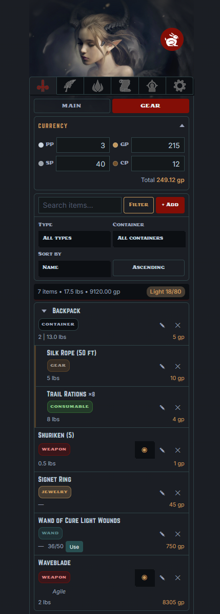 | 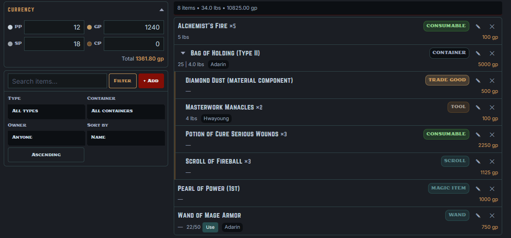 |

#### The forge

The **forge** crafts custom magic weapons, armor, and shields the way the rulebook prices them. Pick a base item, choose an enhancement bonus from +1 to +5, then layer on special abilities — Flaming, Keen, Frost, Defending, and the rest of the standard tables. As you build, the forge tracks the **effective bonus** against the +10 cap, totals the price, and names the item for you. Save it and the forged item joins your custom-items list, ready to add to any character — where its modifiers apply exactly like any other piece of gear.

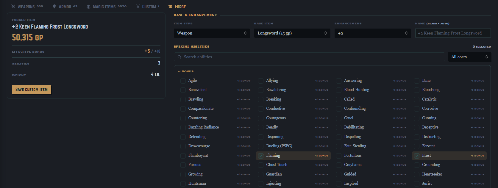

### Familiars and companions

Alongside player characters, Wayfinder tracks familiars and animal companions as their own sheets. Link one to its master and it can draw hit points and base attack bonus from that character; companions use a level-driven statistics table for base attack, saves, natural armor, and ability gains.

### References

Link rules notes from your vault to the relevant places on a sheet and read them without leaving the sidebar. References can be searched, pinned to a favorites rail, and ticked off where a note contains a checklist. If you also use the companion **[Carrel](https://github.com/alas-poor-ophelia/carrel)** plugin, the References tab becomes a themed board of typed cards; without it, you get a built-in list view.

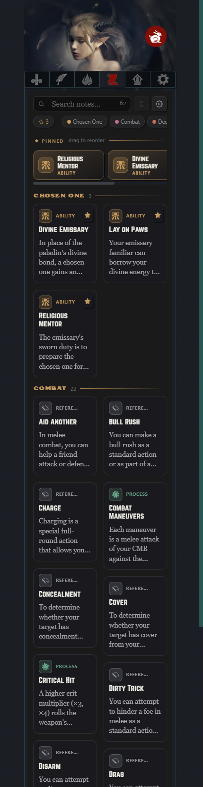

## Configuration

Open **Settings → Wayfinder**:

- **Rules folder** — where Wayfinder looks for the rules notes it links to.
- **Spells folder** — where per-spell notes live, for linking from the spellbook. Point this at the [spell reference-note pack](#spell-reference-notes-optional) or at your own spell notes.
- **Custom items file** — the JSON file your forged items are saved to (created at the vault root on first save).
- **Elephant in the Room** — a house-rule toggle. When on, the popular EiTR ruleset will be applied. **BETA**.
- **Use Carrel for References** — shown when the Carrel plugin is installed; switches the References tab between the built-in list and the Carrel board.

### Appearance

If you use the community **Style Settings** plugin, Wayfinder exposes its two accent colors (a deep red and a warm gold) and its three fonts (display, label, and body) for customization. A single toggle drops the brand styling entirely and inherits your active Obsidian theme's accent color and fonts instead.

## Storage and sync

Character data is held in the plugin's own `data.json`; forged custom items are kept in a separate JSON file at your vault root. Both travel with the vault, so Wayfinder works with Obsidian Sync. When the data file changes underneath a running session — as it does after a sync — Wayfinder picks up the change rather than overwriting it.

## Requirements

- Obsidian on desktop or mobile. The sheet is built for a narrow sidebar and tuned for iPad-sized touch targets.
- No other plugin is required. **[Style Settings](https://github.com/mgmeyers/obsidian-style-settings)** (for theming) and **[Carrel](https://github.com/alas-poor-ophelia/carrel)** (for the richer References board) are optional.

## Known limitations

- Wayfinder covers Pathfinder 1st Edition only.
- The plugin doesn't bundle readable prose. You write and link your own **rules** notes; the full **spell descriptions** ship separately as an optional [reference-note pack](#spell-reference-notes-optional), since thousands of spell notes are far past a plugin's size budget. The spell and item *databases* it does bundle are statistical — levels, prices, components, and the like — for the searchable tables and the math.
- The sidebar sheet shows one active character at a time.
- Some archetypes are only **partially implemented** — they're labelled *partial* where you select them. A partial archetype still works and applies what it can; nothing breaks. But some of its details aren't wired into the math yet and may need to be added by hand — a missing resource pool under **Effects → Resource pools**, or a situational bonus as a quick action or custom buff.

## Feedback

Bug reports and suggestions are welcome on the issue tracker. When reporting a calculation problem, the most useful thing to include is the character's classes, levels, and the specific number you expected versus the one shown.

## License

Released under the MIT License. See [LICENSE](LICENSE).
